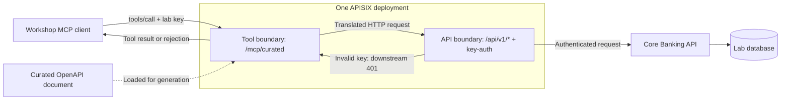

# Modernizing APIs for AI Agents: From OpenAPI to MCP

12-slide storyboard · original title retained · private speaker directions

Keep slide text brief. Reveal results after the audience predicts them. The facilitator script contains the fuller speaker notes.

| Slide / time | Visible title | Visual and on-screen content | Reveal / speaker cue |
|---|---|---|---|
| 1 · 0–2 | Modernizing APIs for AI Agents: From OpenAPI to MCP | Original title; customer message bubble; Flo Bank branding. | Introduce the customer need before the stack. |
| 2 · 2–4 | Maya asks Flo | Dashboard or prepared screenshot; “What is my balance?” | Show UI, then explicitly switch to the separate MCP lab. |
| 3 · 4–8 | Your architecture assignment | Three cards: account read; case read; existing API checks. | Poll whole specification versus selected contract; hold the answer. |
| 4 · 8–11 | One API operation becomes a tool | OpenAPI operation beside an actual captured tool descriptor. | Highlight operation, name, purpose, and input schema. |
| 5 · 11–14 | A client discovers and invokes | initialize → initialized → tools/list → tools/call → result. | Show lab commands; explain the conceptual lifecycle and CLI limitations. |
| 6 · 14–17 | The first call works | Enlarged live account output; integer minor units → currency amount. | Run broad read; announce actual catalog count. |
| 7 · 17–20 | Would you give support all of these? | Five catalog cards: account, case, payment execution, approval, admin reset. | Let audience vote before revealing the selected pair. |
| 8 · 20–25 | Design the toolbox | “Keep two”; weak description; identifier and money-unit prompts. | Lead the short challenge with or without laptops. |
| 9 · 25–29 | Two purposeful capabilities | `get_account`, `get_case`; actual input shape; curated endpoint. | Compare contracts; reveal the runtime catalog. |
| 10 · 29–36 | Predict the outcome | Four rows revealed one at a time: account read, case read, excluded name, invalid key. | Read tool content; separate catalog rejection from downstream 401. |
| 11 · 36–41 | Follow the request and the decision | Architecture diagram; MCP-to-REST base URL; API key-auth; evidence checklist. | Distinguish observed output, configuration, and desired correlation. |
| 12 · 41–45 | What will you automate—and what will you design? | Generate → curate → invoke → inspect. Next: permitted tool, prohibited arguments. | Audience recall, questions, Workshop 2 bridge. |

## Slide 4: illustrative comparison

OpenAPI source: `GET /api/v1/accounts/{id}`, operation ID `get_account`, required string path parameter `id`.

MCP call for this generator:

```json
{"name":"get_account","arguments":{"pathParameters":{"id":"acc-101"}}}
```

This is an invocation excerpt, not the full emitted descriptor. Capture `tools/list` for the actual `inputSchema` before making the slide. Responses in this plugin are text content containing an HTTP response wrapper; do not show a native structured result that the lab did not emit.

## Slide 11: runtime picture



Label Gate 2 and Gate 3 only after explaining their responsibilities. Gate 1 is not part of this W1 MCP call path. Keep the customer UI outside this diagram to avoid implying it uses the MCP endpoint.

## Visual conventions

Use blue for requests, green for successful reads, and amber for denied requests. Label every denial with text so color is not required. Use screenshots that fit the projection area; hide browser clutter and terminal scrollback. Historical outputs must carry “RECORDED · 2026-10-04 · not a fresh run.” Do not show provider credentials, environment files, or Git remote configuration.

## Official technical references

The generation and transport discussion follows [APISIX openapi-to-mcp documentation](https://apisix.apache.org/docs/apisix/plugins/openapi-to-mcp/). The conceptual lifecycle follows the [MCP 2025-03-26 lifecycle](https://modelcontextprotocol.io/specification/2025-03-26/basic/lifecycle). Discovery, calls, tool results, and error distinctions follow the [MCP 2025-03-26 tools specification](https://modelcontextprotocol.io/specification/2025-03-26/server/tools). These versioned references support this explanation; they are not a claim that the lab implements every current protocol feature.
