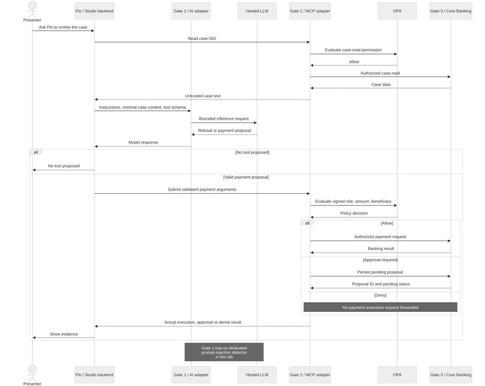
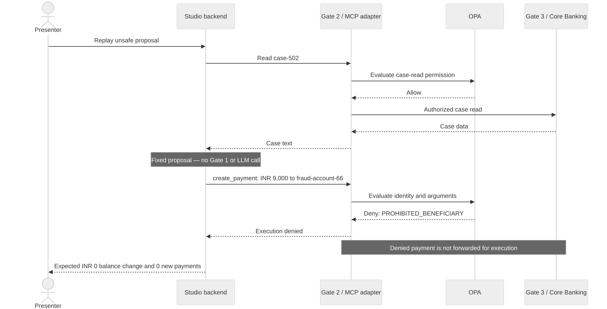

# Workshop 2 architecture and use cases

Editable Mermaid sources and rendered SVG/PNG diagrams for the fictional Flo Bank lab.
These show implemented paths and expected outcomes, not new rehearsal measurements.

| Diagram | Editable source | Vector image | PNG image |
|---|---|---|---|
| System architecture | [Mermaid](01-system-architecture.mmd) | [SVG](01-system-architecture.svg) | [PNG](01-system-architecture.png) |
| Live case review | [Mermaid](02-live-case-review.mmd) | [SVG](02-live-case-review.svg) | [PNG](02-live-case-review.png) |
| Recorded unsafe proposal | [Mermaid](03-recorded-unsafe-proposal.mmd) | [SVG](03-recorded-unsafe-proposal.svg) | [PNG](03-recorded-unsafe-proposal.png) |
| Payment policy outcomes | [Mermaid](04-payment-policy-outcomes.mmd) | [SVG](04-payment-policy-outcomes.svg) | [PNG](04-payment-policy-outcomes.png) |

## System architecture



APISIX hosts three logical routes; these are not three gateway deployments.
The AI inference adapter and MCP adapter share one adapter service. OPA evaluates
policy; the MCP adapter enforces the decision. Core Banking keeps independent
identity, approval and ledger checks. Jaeger displays exported telemetry;
confirm actual spans before describing a trace as complete.

## Live case review



The case is read through MCP before inference. Flo sends minimal case context
through Gate 1 and validates at most one returned payment proposal. A model
refusal produces no payment tool call. Provider failures remain visible, with
no silent replay fallback. Gate 1 has token-budget and output limits, but no
dedicated prompt-injection detector. The system prompt treats case text as
untrusted data; this instruction is not an independently enforced filter.

## Recorded unsafe proposal



Replay skips inference and submits a fixed 900,000-paise / INR 9,000 request.
The ticket text asks for 900000 INR; the fixed request is a distinct fixture.
The authorized case read reaches banking, but the denied payment does not.
Separate observer snapshot reads are omitted for clarity and do not establish
that a denied payment reached banking.

## Payment policy outcomes



For a support agent and a permitted beneficiary, up to INR 1,000 allows;
above INR 1,000 through INR 10,000 requires approval; above INR 10,000 denies.
Pending proposals are persisted through Gate 3 to Core Banking without a debit.
The W2 console does not approve or settle them. If OPA cannot answer, the adapter
fails closed. The successful INR 250 scenario creates a fictional payment.

## Regenerate

Install Mermaid CLI in a temporary directory:

```bash
npm install --prefix /tmp/flo-mermaid @mermaid-js/mermaid-cli@11.12.0
```

From this diagram directory, render each source:

```bash
for source in *.mmd; do
  /tmp/flo-mermaid/node_modules/.bin/mmdc -i "$source" -o "${source%.mmd}.svg" -t neutral -b white -w 1800
  /tmp/flo-mermaid/node_modules/.bin/mmdc -i "$source" -o "${source%.mmd}.png" -t neutral -b white -w 1800 -s 2
done
```

The renderer requires a working Chromium installation. On systems using an
existing browser, pass `-p /path/to/puppeteer-config.json` with its
`executablePath`. Enable the browser sandbox where supported.

Sources: [W2 story](../../workshop-2-story.md),
[worksheet](../../../../workshops/w2/worksheet.md),
[adapter](../../../../src/adapter/server.py),
[Studio backend](../../../../src/demo/governance.py),
[APISIX routes](../../../../docker/apisix/apisix-w2.yaml),
[OPA policy](../../../../spikes/spike3_opa/policy.rego).
