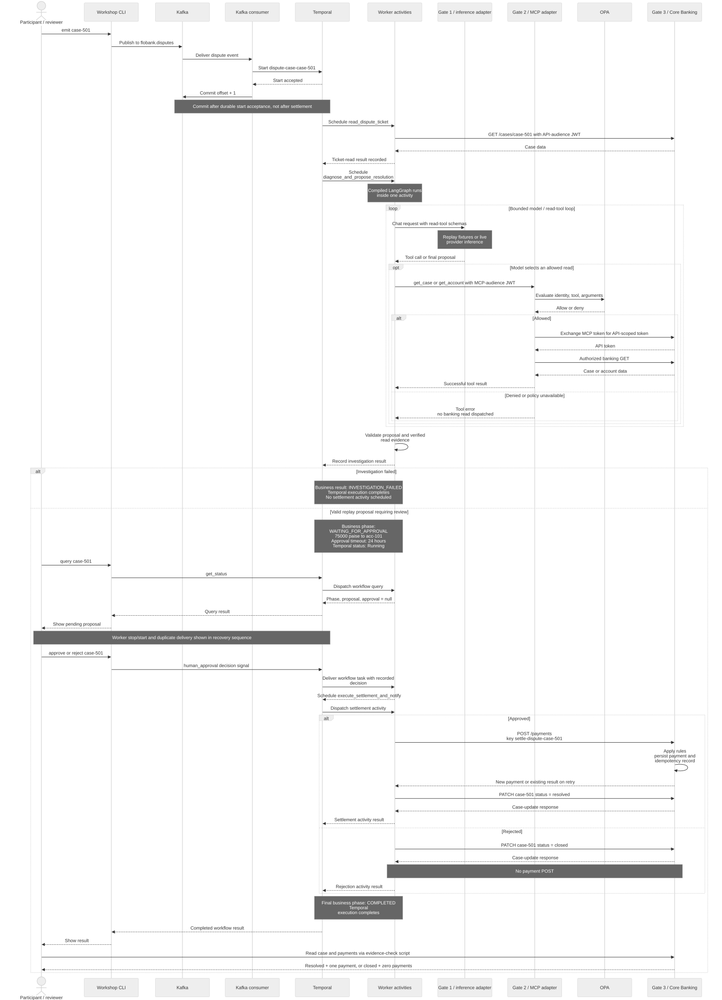
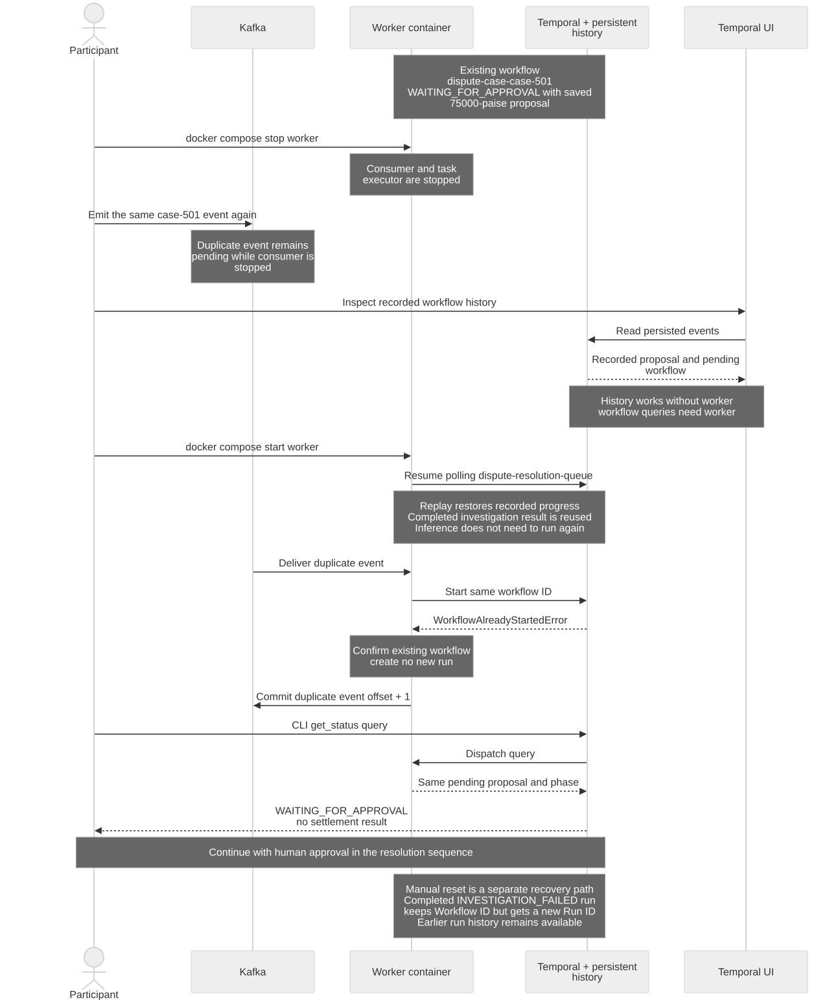

# Workshop 3 architecture and sequences

Editable Mermaid sources and rendered SVG/PNG diagrams for the implemented
Flo Bank dispute resolver. These explain the lab paths; they are not additional
rehearsal measurements.

| Diagram | Editable source | Vector image | PNG image |
|---|---|---|---|
| System architecture | [Mermaid](01-system-architecture.mmd) | [SVG](01-system-architecture.svg) | [PNG](01-system-architecture.png) |
| Investigation, approval, and settlement | [Mermaid](02-resolution-sequence.mmd) | [SVG](02-resolution-sequence.svg) | [PNG](02-resolution-sequence.png) |
| Worker restart and duplicate event | [Mermaid](03-crash-recovery-sequence.mmd) | [SVG](03-crash-recovery-sequence.svg) | [PNG](03-crash-recovery-sequence.png) |

## System architecture



Kafka owns event delivery and consumer offsets. Temporal owns durable workflow
history and task scheduling. LangGraph performs bounded reasoning inside an
activity. Core Banking owns payment records and idempotency. Kafka consumer,
workflow task executor, and activities share the replaceable worker container.
Temporal's SQLite history lives in a separate persistent volume. Banking uses
SQLite by default; `DATABASE_URL` determines the configured backend.

APISIX provides three logical routes in one gateway. Inference and MCP handlers
share an adapter service. The initial ticket read and settlement use Gate 3
directly; model-selected investigation reads use Gate 2, OPA, token exchange,
and Gate 3. The model does not call the settlement API. Replay uses recorded
model responses while retaining governed tool reads and banking controls.

Worker issuer and API audience must match the API; the MCP audience must match
the adapter. Temporal UI connects to the same Temporal service, with write
actions disabled. Recorded history is available while the worker is stopped;
workflow queries need a worker. Jaeger shows exported telemetry, not ledger
proof or a guaranteed complete trace.

## Investigation, approval, and settlement



The replay example proposes 75,000 paise (₹750) to `acc-101` for `case-501`.
It requires human review and uses settlement key `settle-dispute-case-501`.
The fixture's duplicate-debit rationale is not transaction proof; the tool
results return a case description and account details. The manual exercise
verifies one approved payment independently through the banking API.

The sequence focuses on the replay amount. Lower proposals may auto-approve
under the resolver's rules; amounts above 100,000 paise also require a separate
Core Banking proposal/approval path, omitted here. The rejection branch closes
the case without a payment POST. A failed investigation returns a business
failure normally, so Temporal may show its execution as Completed.

Activities can retry. Stable payment idempotency returns an existing result
after a committed payment's response is lost. The manual stop/start exercise
does not test this payment-commit failure window. LangGraph does not checkpoint
each unfinished step separately in Temporal. The lab approval timeout is
24 hours, not an implemented multi-week process.

The activity currently does not check the PATCH response status before returning
its settlement result. Verify the actual case status and payment count with the
worksheet's banking evidence check before claiming the case is resolved.
Likewise, `notification_sent` is a result flag in this lab, not evidence of an
external notification delivery service.

## Worker restart and duplicate event



Kafka offset commit follows Temporal start acceptance or confirmation of the
existing workflow. A duplicate event during the approval wait does not create
a new run. The consumer uses `ALLOW_DUPLICATE_FAILED_ONLY`; a Temporal-level
failed run may be started again, whereas the normally completed
`INVESTIGATION_FAILED` business result needs the targeted reset in the worksheet.
That reset preserves the Workflow ID and creates a new Run ID; it is distinct
from the crash-recovery exercise. Duplicate-event logs and Kafka offsets appear
in worker logs, not as Kafka events in Temporal history.

## Regenerate

Install Mermaid CLI in a temporary directory:

```bash
npm install --prefix /tmp/flo-mermaid @mermaid-js/mermaid-cli@11.12.0
```

From this diagram directory, render each source:

```bash
for source in *.mmd; do
  /tmp/flo-mermaid/node_modules/.bin/mmdc -i "$source" -o "${source%.mmd}.svg" -c mermaid-config.json -t neutral -b white -w 1800
  /tmp/flo-mermaid/node_modules/.bin/mmdc -i "$source" -o "${source%.mmd}.png" -c mermaid-config.json -t neutral -b white -w 1800 -s 2
done
```

The renderer requires Chromium. For an existing browser, pass
`-p /path/to/puppeteer-config.json` with its `executablePath`. Enable the browser
sandbox where supported.

Sources: [W3 worksheet](../../../../workshops/w3/worksheet.md),
[story](../../workshop-3-story.md),
[Kafka consumer](../../../../src/worker/kafka_consumer.py),
[workflow](../../../../src/worker/workflow.py),
[activities](../../../../src/worker/activities.py),
[LangGraph investigation](../../../../src/worker/dispute_agent.py),
[MCP adapter](../../../../src/adapter/server.py),
[banking](../../../../src/services/banking.py),
and [Compose](../../../../docker-compose.yml).
