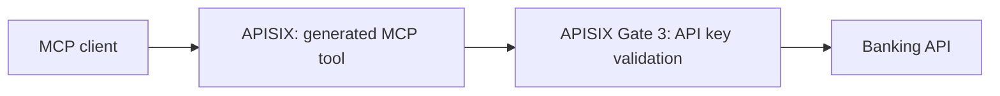

# Workshop 1 Story: Give Flo the Right Tools

**Modernizing APIs for AI Agents: From OpenAPI to MCP**  
**Duration:** 45 minutes · **Profile:** `w1` · **Setting:** fictional Flo Bank

Use the [W1 worksheet](../../workshops/w1/worksheet.md) for participant commands,
the [answer key](../../workshops/w1/answer-key.md) for presenter preparation, and
the [delivery plan](delivery-plan.md) for the series outcomes.

## The business story

Flo Bank wants its support agent to answer account questions and inspect support
cases. The bank already has REST APIs and an OpenAPI contract. The integration
team proposes generating MCP tools from that contract rather than rebuilding
the banking services.

The first catalog exposes more than support needs: payment and administrative
operations sit beside account reads. Participants become the integration team
and decide which capabilities belong in a support agent's catalog. They finish
with two purposeful read tools and evidence that MCP calls still encounter
downstream API authorization.

**Opening line:**

> “Flo needs to read an account and understand a support case. Our bank already
> has those APIs. How do we give Flo useful tools without handing it every
> operation the bank has?”

## Before the audience arrives

Prepare the profile, seeded fictional data and Python environment using the
[facilitator guide](facilitator-guide.md). Complete downloads and startup before
the timed session. Run `./scripts/workshop verify w1` and save any previous
evidence before using the documented reset procedure.

Have the broad and completed contracts open beside the terminal. W1 uses
APISIX's native `openapi-to-mcp` plugin: `/mcp` serves the broad contract and
`/mcp/curated` serves the completed contract. Both translate tool calls back
through Gate 3. These CLI exercises require no hosted-model inference; the
customer chat is a separate surface and is scripted by default in W1.

## Scene 1 — A support request meets an existing API (0–5 minutes)

**Show:** the account-read operation and fictional account `acc-101`.

**Say:**

> “A customer asks about their balance. The bank has a structured account API;
> the agent needs a discoverable capability with clear inputs and useful output.
> We will keep the banking service and adapt how that capability is offered.”

Ask participants to name the minimum capabilities for account support. Keep
account and case reads visible as the target scope.

## Scene 2 — From an HTTP contract to a tool conversation (5–12 minutes)

Compare an OpenAPI operation's method, path and schema with MCP initialization,
tool discovery and invocation. Initialize the supplied client:

```bash
python workshops/w1/client.py init
```

**Say:**

> “OpenAPI describes the HTTP service. MCP lets a client discover tools and
> invoke them using structured arguments. Generation connects those interfaces;
> we still need to decide what the client should be allowed to discover.”

**Participant prompt:** “Which parts can a generator derive, and which require
knowledge of the support team's job?”

## Scene 3 — The generator gives Flo too much (12–22 minutes)

```bash
python workshops/w1/client.py list
```

Inspect the actual catalog and its tool count. Locate payment execution and
database-reset operations without invoking them. The broad catalog is a teaching
checkpoint; available authorization still governs execution.

**Say:**

> “The generator has represented the API contract it received. It does not know
> that our support assistant only needs reads. A technically valid tool catalog
> can still offer the wrong capabilities for the job.”

Have pairs mark operations to retain, remove or rename. Compare the
[broad contract](../../workshops/w1/checkpoints/initial/openapi-broad.json) with
the [completed contract](../../workshops/w1/checkpoints/completed/openapi-curated.json).
The completed contract contains `get_account` and `get_case`, with descriptions
and integer minor-unit balance semantics. Tool descriptions help selection;
authorization remains a server responsibility.

## Scene 4 — A useful read and an executable curated catalog (22–32 minutes)

```bash
python workshops/w1/client.py call-account acc-101
```

Show the returned account ID, balance and currency. Fresh seed data has
`1500000` minor units, or **₹15,000**, for `acc-101`; record the actual result if
the ledger has changed.

Then show discovery at `/mcp/curated` and a `get_account` invocation using the
requests in the [W1 rehearsal](../../workshops/w1/rehearsal_w1.py). The completed
catalog should contain exactly `get_account` and `get_case`. Demonstrate that an
excluded mutation is rejected by tool lookup; do not perform a financial or
administrative mutation to prove its absence.

**Say:**

> “Curation is observable behavior: the intended reads are discoverable and
> usable, and removed operations cannot be called through this catalog.”

Use the preconfigured completed endpoint for the comparison. If editing a
contract during delivery, verify cache refresh and discovery before claiming
the running catalog changed.

## Scene 5 — The tool still enters the bank's front door (32–40 minutes)

Draw the execution path:



```bash
python workshops/w1/client.py call-unauthorized
```

Inspect the embedded downstream response, not only the outer MCP HTTP status.
Expect a Gate 3 authorization failure with no successful account result.
Use gateway routing/log evidence to substantiate where the request stopped.

**Say:**

> “Turning an API into a tool must preserve its enforcement path. This call
> re-enters the API gateway, so missing credentials still stop the banking
> request.”

W1 demonstrates the lab's API-key boundary. It does not establish complete
customer-specific authorization or production identity management.

## Scene 6 — Capability design becomes the integration contract (40–45 minutes)

Return to the support request. Have each pair explain one removed operation,
one improved tool description and the authorization evidence they saved.

**Closing line:**

> “Flo now has tools designed for its job, and those tools preserve the bank's
> API boundary. Next we will ask who may use a tool, with which arguments, when
> the information it reads contains instructions from an attacker.”

## Evidence participants take away

| Story moment | Evidence | Expected result |
|---|---|---|
| Generation | Broad tool names and schemas | Useful reads mixed with excessive capabilities |
| Curation | Completed contract and actual curated discovery | Only `get_account` and `get_case` |
| Invocation | Account response and units | Authorized read succeeds |
| Exclusion | Removed-tool invocation result | Tool lookup rejects the operation |
| Authorization | Embedded denial and gateway evidence | Missing downstream credentials fail at Gate 3 |

Bridge to [Workshop 2: The Ticket That Tried to Give Orders](workshop-2-story.md).
