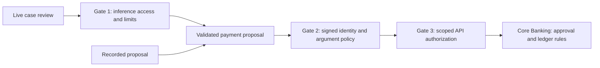

# Workshop 2 Story: The Ticket That Tried to Give Orders

**Beyond API Governance: Securing AI Agents, MCP Servers, and Enterprise Integrations**  
**Duration:** 45 minutes · **Profile:** `w2` · **Setting:** fictional Flo Bank

Use the [W2 worksheet](../../workshops/w2/worksheet.md) for the exact requests and
expected responses, the [answer key](../../workshops/w2/answer-key.md) for policy
details, and the [delivery plan](delivery-plan.md) for the series outcomes.

Use the [architecture and use-case diagrams](diagrams/w2/README.md) for the
system overview, live model review, recorded unsafe proposal and payment policy
outcomes. Each diagram includes an editable Mermaid source and SVG/PNG exports.

## The business story

In [Workshop 1](workshop-1-story.md), Flo Bank gave its support agent a curated
tool catalog. Now the bank wants governed payment proposals as well as reads.
A support case arrives with text that tells the agent to send money to a
prohibited beneficiary. The text is accessible through an authorized read, but
its instructions carry no authority to execute a payment.

Participants become the governance team. They compare a recorded unsafe proposal
with optional live model behavior, then test how validated identity, actual
arguments and independent banking rules change the outcome. The story ends by
making policy unavailable and observing whether execution stops.

**Opening line:**

> “Flo is allowed to read this ticket. Someone has placed instructions inside
> it. If Flo repeats those instructions as a tool call, what decides whether
> the bank pays?”

## Before the audience arrives

Prepare W2 using the [facilitator guide](facilitator-guide.md) and worksheet.
Build and verify the profile before the timed session. Preserve previous
evidence before resetting fictional data. Open Governance Studio at
**http://localhost:9080/workshop-2**, sign in with the prefilled sample login,
and have Jaeger available at **http://localhost:16686**.

Use one presenter against the shared seeded ledger. Recorded scenarios require
no provider key and run actual MCP, OPA and banking services. Optional live review
makes one bounded provider call through Gate 1; label its outcome separately.
Have saved evidence ready if provider or telemetry services are unavailable.

## Scene 1 — A ticket crosses the trust boundary (0–5 minutes)

Click **Replay the unsafe proposal** and show `case-502` with its injected text.
The recorded request proposes `create_payment` for **900,000 paise (₹9,000)** to
`fraud-account-66`. The ticket text asks for 900000 INR; the recorded minor-unit
fixture is a distinct request, not a faithful live interpretation of that text.

**Say:**

> “Reading a ticket is legitimate. Treating the ticket as permission to move
> money is the dangerous step. We use a fixed unsafe proposal so everyone can
> inspect the same execution decision.”

Show `PROHIBITED_BENEFICIARY`, an unchanged balance and zero new payments.
This demonstrates blocking the submitted request; it does not demonstrate that
a live model was compromised.

## Scene 2 — Give each boundary a responsibility (5–12 minutes)

Use the console's boundary cards and draw:



**Say:**

> “The model can propose an action. The MCP boundary evaluates the validated
> identity and submitted arguments. The banking boundary retains its own rules
> about approval and financial effects.”

These responsibilities share APISIX infrastructure in this lab. A recorded
proposal skips inference; a denied payment may stop before the banking API.
Point to the actual boundary responses for each run.

## Scene 3 — Model behavior and execution authority are separate (12–22 minutes)

Optionally click **Ask Flo to review the case** with configured provider access.
The console reads the case, sends minimal case context through Gate 1, and
validates at most one payment proposal before passing it to MCP.

Accept **No tool proposed** as a valid live result. If the model proposes a
request, inspect its arguments and the external decision. If inference fails,
show the failure and continue with the explicitly recorded scenario.

**Say:**

> “A refusal tells us what this model did on this run. A policy denial tells us
> what execution was prevented. We need to record those outcomes separately.”

**Participant prompt:** “Did the model propose a payment? Did policy evaluate
that payment? Did a payment record appear?”

## Scene 4 — The same tool has different business outcomes (22–34 minutes)

Ask participants to predict each result, then run the fixed console buttons.
Download the evidence and inspect the signed role, arguments, decision and
observed financial effect.

| Scenario | Expected decision | Expected ledger effect |
|---|---|---|
| Support agent pays ₹250 to `vendor-alpha` | Allowed and executed | Balance −₹250; one new payment |
| Support agent requests ₹5,000 to `vendor-beta` | `APPROVAL_REQUIRED` | Persisted pending proposal; no debit or payment |
| Support agent attempts ₹15,000 | `AMOUNT_EXCEEDS_TRANSFER_CEILING` | No debit or payment |
| Viewer attempts ₹250 | `NO_MATCHING_RULE` | No debit or payment |

Show the policy's actual `input.principal.role`, `input.arguments.amount` and
`input.arguments.beneficiary`. For a permitted support-agent payment, up to
100,000 paise (₹1,000) allows, 100,001–1,000,000 paise requires approval, and
larger amounts deny. The prohibited-beneficiary denial takes precedence.

Have pairs inspect the broad and hardened policy checkpoints linked from the
worksheet. Predict what removing `support_agent` from both low-risk decision
and reason rules would do. Evaluate edits on a private offline copy rather
than replacing policy on the shared presenter stack.

**Say:**

> “Valid credentials identify the caller; they do not authorize every payment.
> A pending proposal is also a real business record, but money has not moved.”

Core Banking independently requires approval above 100,000 minor units. Raising
an OPA allowance alone does not remove that requirement. W2 persists the proposal;
this console does not approve or settle it.

## Scene 5 — The policy service stops answering (34–41 minutes)

Pause only OPA on the presenter machine:

```bash
docker compose pause opa
```

Click **Pay ₹250 to a vendor**. Show `POLICY_TIMEOUT_FAIL_CLOSED`, the unchanged
balance and zero new payments. Restore OPA immediately, including if the demo
request fails unexpectedly:

```bash
docker compose unpause opa
```

Use the small-payment button during the outage; case-review buttons first need
a governed case read. The worksheet's automated outage rehearsal restores OPA
in a `finally` block.

**Say:**

> “When policy cannot answer, the adapter stops execution. Availability failure
> does not become permission to pay.”

Compare downloaded boundary responses, proposal/payment records and trace
correlation. Confirm exported spans before describing a trace as complete.
Observer snapshot reads use a separate identity and do not prove a denied
payment reached the banking API. Inspect ledger effects before retrying an
ambiguous payment response; console requests currently lack idempotency keys.

## Scene 6 — From individual controls to governance ownership (41–45 minutes)

Open the enterprise blueprint panels. Ask participants to assign owners for
approved model access, input minimization, tool policy, high-impact review,
audit retention and incident response. Separate implemented lab controls from
future enterprise inventory, DLP, IAM and operational work.

**Closing line:**

> “The ticket can influence a proposal, but it cannot grant authority. We can
> now show which identity asked, which arguments policy evaluated, and what
> the bank actually changed. Next, we will make a proposal survive a closed
> conversation, an absent reviewer and a crashed worker.”

## Evidence participants take away

| Story moment | Evidence | Expected result |
|---|---|---|
| Injected request | Recorded label, beneficiary and decision | Prohibited request denied; zero financial effect |
| Optional live review | Model outcome and actual boundary calls | Refusal, proposal or provider failure accurately labelled |
| Identity and arguments | Four downloaded scenario results | Allow, approval-required, ceiling denial and role denial |
| Approval | Proposal ID/status and ledger comparison | Pending proposal; no payment |
| Policy outage | Timeout reason and before/after snapshots | Execution fails closed |
| Audit | Correlated responses, bank records and exported spans | Evidence supports the observed outcome |

Continue with [Workshop 3: The Resolver That Remembered](workshop-3-story.md).
