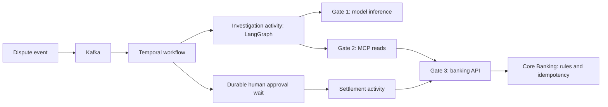

# Workshop 3 Story: The Resolver That Remembered

**Architecting the Agentic Enterprise: Middleware, Durable State, and Event-Driven AI**\
**Duration:** 45 minutes · **Profile:** `w3` · **Setting:** fictional Flo Bank

Visual reference: [architecture and sequence diagrams](diagrams/w3/README.md)
with editable Mermaid sources and rendered SVG/PNG images.

Based on [Topic 3 in the workshop brief](workshot.txt), with the running lab in the
[W3 worksheet](../../workshops/w3/worksheet.md) and the architectural boundaries in
the [delivery plan](delivery-plan.md#workshop-3--architecting-the-agentic-enterprise-middleware-durable-state-and-event-driven-ai).

## The story connecting Workshops 1, 2, and 3

In Workshop 1, Flo Bank gave its support agent a carefully curated set of MCP
tools over existing banking APIs. The agent could discover useful capabilities
and read account information through the API gateway.

In Workshop 2, Flo Bank added execution controls. Untrusted support-ticket text
could suggest an action, but identity, tool policy, and banking rules determined
whether that action could run. A payment needing approval remained a proposal.

Now operations asks the next question: **What happens to that proposal when the
customer closes the chat, the approver comes back tomorrow, or the worker crashes?**

Flo Bank introduces an **Autonomous System Resolver**, demonstrated here as a
customer-dispute resolver. It receives a case event, investigates through governed
MCP tools, proposes a resolution, and waits for human sign-off. During that wait,
the presenter deliberately stops the worker and sends the same event again.
The workshop ends by showing whether the bank remembers the decision and settles
only once.

**Opening line:**

> “We have taught Flo which tools it can use and which actions it may take. Today
> we give its work a durable life beyond a single chat session.”

## Cast and business stakes

| Character or component | Role in the story |
|---|---|
| Customer | Reports a disputed charge on the account associated with `case-501` |
| Flo Resolver | Investigates evidence and proposes a resolution using a bounded LangGraph tool loop |
| Operations reviewer | Reviews the exact proposal and supplies the approval or rejection decision |
| Kafka | Delivers the case event; redelivery is expected |
| Temporal | Records workflow progress, completed activity results, and the approval decision |
| MCP and API gateways | Keep investigation and settlement behind governed enterprise capabilities |
| Core Banking | Applies banking rules and payment idempotency at the business boundary |

The business outcome is a resolved case with one approved settlement payment, or
a rejected case with no settlement payment. A plausible model response alone is
insufficient evidence of either outcome.

## Before the audience arrives

Prepare the `w3` profile using the [facilitator guide](facilitator-guide.md) and
[participant infrastructure guide](participant-infra-guide.md).
Run installation, image downloads, profile switching, and smoke checks before the
45-minute session. Start from fresh fictional lab data using the established
reset procedure; save any previous evidence first.

Have the case, workflow query, worker logs, and banking evidence ready to show.
Use the CLI and existing lab surfaces for this story; it does not require a new
browser console.

Declare the inference mode at the start:

- **Live:** the graph calls the configured MiniMax model through Gate 1. Inspect
  the actual tool selections, proposal, and outcome rather than promising fixed wording.
- **Offline replay:** provider fixtures drive the same compiled graph, while
  gateway reads and banking controls still run. The recorded `case-501` proposal
  is 75,000 paise, or ₹750, to `acc-101`; this is a demonstration fixture, not a
  verified refund calculation from the ticket's claimed charge.

Read the seeded ticket as it actually appears. Describe it as a disputed charge;
verify evidence before claiming a duplicate charge or an established refund entitlement.

## Scene 1 — A customer leaves; the work continues (0–6 minutes)

**Show:** `case-501`, its customer/account context, and the selected inference mode.

**Say:**

> “A customer has reported a disputed charge. They should be able to leave the
> chat while the bank investigates. Our resolver must read the case, propose a
> resolution, and wait for operations. That work needs to survive independently
> of the browser and the process that happens to be running it.”

Invite participants to predict where the case, proposal, approval, and payment
will live. Capture the failure they worry about most: lost progress, a repeated
investigation, a missing approval, or two payments.

**Transition:** “Before we start the agent, let us decide who remembers what.”

## Scene 2 — Give each kind of state an owner (6–13 minutes)

Draw the path from event to business effect:



**Say:**

> “Kafka remembers that an event needs handling. Temporal remembers where the
> business process has reached. LangGraph runs the investigation and tool loop
> inside an activity. Core Banking remembers whether a settlement has already
> been applied.”

Use the concrete identities throughout: the case is `case-501`, the Temporal
workflow is `dispute-case-case-501`, and the settlement idempotency key is
`settle-dispute-case-501`.

Explain that the consumer commits its Kafka offset after Temporal accepts the
workflow start or confirms the matching existing workflow. Model and network
calls belong in activities so workflow history can replay deterministically.
A failed investigation activity may repeat inference and reads; completed
activity results are available in Temporal history. This lab does not checkpoint
every unfinished LangGraph step.

**Participant prompt:** “If the event arrives twice, which layer prevents another
workflow, and which layer prevents another payment?”

## Scene 3 — The resolver investigates, then stops (13–23 minutes)

Emit the case from the repository root:

```bash
.venv/bin/python workshops/w3/client.py emit --case-id case-501 --customer-id cust-8801
.venv/bin/python workshops/w3/client.py query --case-id case-501
```

Poll the query until the investigation finishes. Show the graph/tool evidence:
which allowed read was selected, what the tool returned, and the final validated
proposal. In live mode, confirm the provider call went through Gate 1 and at
least one model-selected read traversed MCP and the downstream gateway.

**Say:**

> “The resolver can gather evidence and propose compensation. Server rules
> validate the amount and destination and decide whether review is required.
> The reasoning agent cannot grant itself permission to settle.”

**Show:** `WAITING_FOR_APPROVAL`, the proposal's actual amount and destination,
`approval_decision: null`, and no settlement yet. Use the ₹750 fixture as the
predictable replay path. The W3 resolver's review rules are distinct from W2's
support-agent payment thresholds.

**Participant prompt:** “Is this case resolved yet? What evidence would let us
say money has actually moved?”

**Transition:** “The proposal is ready. The reviewer is away. Now the worker fails.”

## Scene 4 — Break the worker and deliver the case again (23–35 minutes)

Before stopping anything, save the workflow ID and proposal. Stop only the W3
worker, leaving Kafka, Temporal, and banking persistence running:

```bash
docker compose stop worker
.venv/bin/python workshops/w3/client.py emit --case-id case-501 --customer-id cust-8801
docker compose start worker
.venv/bin/python workshops/w3/client.py query --case-id case-501
```

Wait for worker readiness and inspect the query and consumer logs. The duplicate
event can remain in Kafka while the worker is stopped; after restart, handling
should confirm the existing workflow.

**Say:**

> “The worker has gone away, and the broker has delivered the same business case
> again. The case still maps to the same workflow. Temporal restores the recorded
> progress, including the proposal and the pending approval.”

Have participants compare before and after: same workflow ID, same proposal,
`WAITING_FOR_APPROVAL`, and no settlement payment. Check logs for duplicate-start
handling rather than interpreting another Kafka message as another business process.

Explain the other failure window: a settlement might commit while its response
is lost. Retrying with the stable idempotency key lets Core Banking return the
existing result without creating another payment. Stopping during the approval
wait demonstrates workflow recovery; it does not itself exercise that
commit/response-loss window.

**Participant prompt:** “Which facts survived because they were durable, and
which operations could still repeat if an activity failed halfway through?”

## Scene 5 — A person approves; the bank settles once (35–41 minutes)

Review the recovered proposal before sending the lab decision:

```bash
.venv/bin/python workshops/w3/client.py approve --case-id case-501 --reviewer ops-lead --comments "Reviewed case evidence and validated proposal"
.venv/bin/python workshops/w3/client.py query --case-id case-501
```

The approval command waits for the workflow result. Show `COMPLETED`, the
settlement result, the resolved case, and the payment record. Count payments
linked to `settle-dispute-case-501`; the expected count for this fresh approved
run is **one**. Compare workflow history and banking evidence, not just the
agent's final message.

**Say:**

> “The approval arrived after the worker restarted. The business process resumed
> from its recorded progress, and the bank applied one settlement. Recovery and
> approval are now visible facts in the history and ledger.”

For the alternate ending, use the separate rejection run in the
[W3 rehearsal](../../workshops/w3/rehearsal_w3.py): a rejected dispute must create
zero payments. Keep this optional if the recovery demonstration uses the full
slot. The lab CLI's reviewer label illustrates a decision signal; production
approval entry needs authenticated reviewers, authorization, and binding to the
exact validated proposal.

## Scene 6 — From a demo pause to an enterprise process (41–45 minutes)

Return to the audience's opening failure predictions and assign each one to its
state owner. Connect the dispute resolver to incident remediation, procurement,
and other processes where investigation and approval outlast a chat session.
Those are architectural extensions, not additional implemented lab scenarios.

**Closing line:**

> “A useful enterprise agent needs governed capabilities, durable progress, and
> a safe route from proposal to approved business effect. Flo can now continue
> the work after the conversation and the worker have ended.”

Explain the limits precisely: this seconds-long crash exercise illustrates a
durable wait. The current workflow's approval timeout is **24 hours**; multi-week
processes require an explicit timeout design and production persistence,
availability, recovery, and operating procedures. LangGraph supplies the reasoning
loop here; the lab does not demonstrate a production multi-agent deployment.

Bridge to Workshop 4: “Next, we will test these boundaries under a deliberate
agent attack and examine the complete Triple-Gate architecture.”

## Evidence participants take away

| Story moment | Evidence to save | Expected fresh-run result |
|---|---|---|
| Investigation | Mode, graph steps, selected tool outcomes, validated proposal | Real governed reads; live and replay clearly labelled |
| Before failure | Workflow ID, proposal, phase, payment snapshot | Pending human review; no settlement |
| After restart and redelivery | Same workflow query and consumer/history evidence | Same pending proposal; duplicate event handled |
| After approval | Workflow result, case status, payment record/count | Resolved case; one settlement under the stable key |
| Optional rejection | Rejection result and payment count | Rejected case; zero settlement payments |

Use `.venv/bin/python workshops/w3/rehearsal_w3.py` for the automated scenario on
a prepared fresh W3 stack. It writes
[`workshops/w3/evidence/rehearsal-evidence.json`](../../workshops/w3/evidence/rehearsal-evidence.json).
The separate recorded [replay](../../workshops/w3/evidence/rehearsal-replay-2026-10-04T085050Z.json)
and [live](../../workshops/w3/evidence/rehearsal-live-2026-10-04T090416Z.json)
rehearsals provide presenter preparation examples; collect new evidence for the
session being delivered.

## Replay evidence caveats from the 2026-10-05 rehearsal

The `case-501` fixture says “Verified duplicate debit”, but the actual case
reports an unapproved charge and `get_account` returns a balance, not transaction
proof. Present that rationale as recorded model text; it does not establish a
double charge or refund entitlement. The reviewer comments in the automated
runner are also synthetic labels, not additional evidence.

The optional `case-502` rejection fixture requests `acc-8802`, which is absent
from the seed and returns 404. The graph records that tool error and still
returns a fixture proposal for mandatory review. The measured result is a
rejected/closed case with zero payments; it does not prove a fully successful
investigation or approval of that unsafe proposal. Show the error if using this
alternate ending. Replay and live diagnosis must remain clearly labelled.
